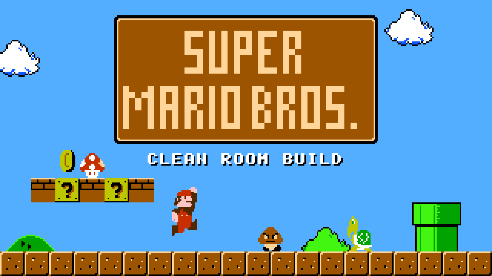

# Super Mario Bros. (NES) — clean room

**Play:** https://andrewnakas.github.io/smb-cleanroom/



A browser build of Super Mario Bros. in which **every tile and every palette is redrawn**. The program, level
layouts, text and the music / sound-effect sequences come from the community disassembly (doppelganger's
`smbdis.asm`, in the asm6f form kept at [Xkeeper0/smb1](https://github.com/Xkeeper0/smb1)); the 8 KB of
character data (the player, enemies, blocks, scenery, font, title logo) and the colour tables are produced by
the code and ASCII drawings in this repository. The ROM is assembled with asm6f from a tree that holds no
retail picture and runs in the page on EmulatorJS (FCEUmm core). No original game file is needed or shipped.

## How it works

```
retail ROM (dirty room only)
   └─ games/smb/extract_spec.py ──> games/smb/spec/pictures.json   coarse facts only: per picture a 1-bit
                                     silhouette and a colour grid of at most 4x4 cells (never per 8x8 tile)
games/smb/art/*.txt + bg_art.py + font.py + title.py + palettes.py
   └─ games/smb/generate.py ──> smb1.chr (512 tiles + our title script), palette tables patched into prg.asm
        └─ asm6f ──> smb.nes (clean)
games/smb/taint_report.py: clean ROM, site and repo vs retail ──> must print "TAINT: 0 failing"
ports/ejs/make_site.py ──> site (EmulatorJS + fceumm + clean ROM)
```

- **Sprites and scenery** (`art/*.txt`, `bg_art.py`): drawn by hand as ASCII (`1 2 3` = colour index) inside the
  kept silhouette. `atlas.py` says which tiles form which picture, from the disassembly's own tables.
- **Font, score popups** (`font.py`, `art.py`): our own glyphs, nothing kept.
- **Title board** (`title.py`): block letters built from 15 quadrant tiles, our own frame and our own nametable
  script (the game streams the title layout out of the character ROM).
- **Palettes** (`palettes.py`): picked from colour-name briefs; index roles follow the code.
- **Sound**: the game has no samples and no voices; music and effects are note tables in the code, kept.

`docs/PLATFORM_NES.md` has the formats, traps and commands for the next NES game; `docs/DECOMP_PLAYBOOK.md` the
general rules.

## Rebuild

```
python -m games.smb.extract_spec <your ROM>        # dirty room, once
sh tools/publish.sh                                # generate, assemble, taint, build the site
python ports/wasm/serve.py D:/n64work/smb/site 8481
```

## Licences

Code in this repository: as in the files. The site bundles EmulatorJS (GPL-3.0) and the libretro FCEUmm core
(GPL-2.0), see `THIRD_PARTY.md` on the site. This is an unofficial fan project, not affiliated with Nintendo.
